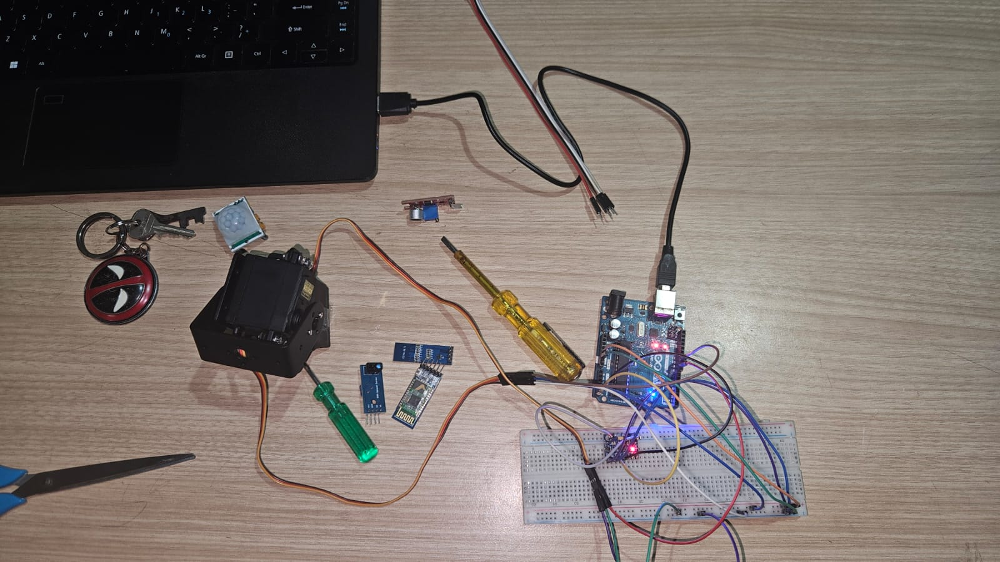
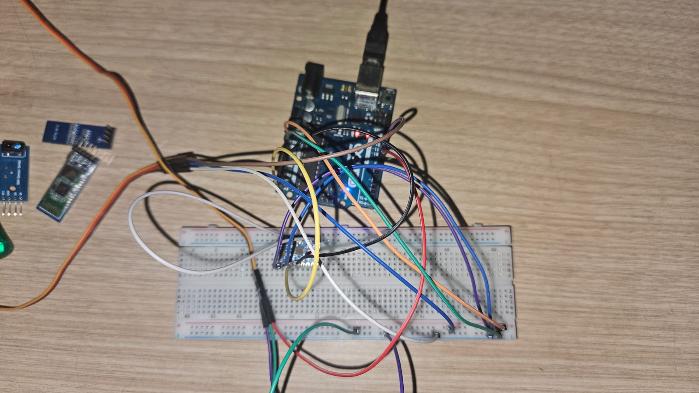

# Gesture Controlled Pan-Tilt System using Arduino Uno, MPU6050 IMU and MG995 Servos

A gesture-controlled pan-tilt system built using an Arduino Uno, MPU6050 IMU, and dual MG995 servo motors. The project estimates device orientation using a complementary filter that combines accelerometer and gyroscope data, enabling smooth and stable dual-axis servo movement.

---

## Status

**Project Status:** Completed

**Board:** Arduino Uno

**Programming Language:** Embedded C++

**Sensor:** MPU6050 IMU

**Actuators:** 2 × MG995 Servo Motors

---

## Overview

This project demonstrates a gesture-controlled pan-tilt mechanism using an Arduino Uno, an MPU6050 Inertial Measurement Unit (IMU), and two MG995 servo motors.

The MPU6050 continuously measures the board's orientation using its built-in accelerometer and gyroscope. A complementary filter combines both sensor readings to generate stable pitch and roll angles while reducing sensor noise and drift.

The calculated pitch and roll values are mapped to two servo motors, allowing intuitive pan and tilt movement through physical hand motion.

This project demonstrates practical concepts used in robotics, embedded systems, motion control, and camera stabilization platforms.

---

## Features

- Gesture-controlled pan and tilt mechanism
- Real-time orientation tracking using MPU6050
- Complementary filtering for smooth motion
- Automatic gyroscope calibration during startup
- Smooth servo interpolation to reduce jitter
- Adjustable sensitivity
- Real-time Serial Monitor debugging
- Built using Arduino Uno

---

## Hardware Used

- Arduino Uno
- MPU6050 IMU
- 2 × MG995 Servo Motors
- Breadboard
- Jumper Wires

---

## Software & Libraries

### Software

- Arduino IDE

### Libraries

- Adafruit MPU6050
- Adafruit Unified Sensor
- Adafruit BusIO
- Servo Library

---

## Connections

### MPU6050

| MPU6050 | Arduino Uno |
|----------|-------------|
| VCC | 5V |
| GND | GND |
| SDA | A4 |
| SCL | A5 |

### Servo Motors

| Servo | Arduino Uno |
|--------|-------------|
| Pan Servo Signal | D9 |
| Tilt Servo Signal | D10 |
| VCC | 5V |
| GND | GND |

> **Note:** During testing and demonstration, both MG995 servo motors were powered directly from the Arduino Uno. While this configuration worked for this prototype, an external regulated 5V supply is recommended for higher loads or continuous operation.

---

## Working Principle

1. MPU6050 measures acceleration and angular velocity.
2. Accelerometer estimates the absolute tilt angle.
3. Gyroscope measures rotational speed.
4. A complementary filter combines both measurements to reduce drift and sensor noise.
5. Calculated pitch controls the tilt servo.
6. Calculated roll controls the pan servo.
7. Smooth interpolation ensures gradual servo movement instead of sudden jumps.

---

## Project Images

### Hardware Setup



### Wiring



---

## Demonstration

A demonstration video is available in the **videos** folder.

```
videos/demo.mp4
```

---

## Repository Structure

```text
mpu6050-pan-tilt-servo-controller
│
├── README.md
├── LICENSE
│
├── code
│   └── MPU6050_PanTilt_Controller.ino
│
├── images
│   ├── setup.jpg
│   └── wiring.jpg
│
└── videos
    └── demo.mp4
```

---

## Future Improvements

- Ultrasonic radar scanning
- Bluetooth mobile control
- ESP32 Wi-Fi integration
- Camera stabilization
- Object tracking
- PID-based stabilization

---

## Contributors

This project was developed as a collaborative effort.

Contributors are listed in the GitHub repository.

---

## License

This project is licensed under the MIT License.
